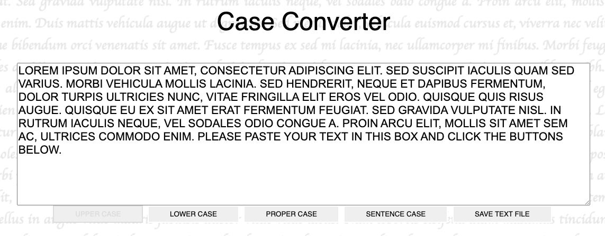
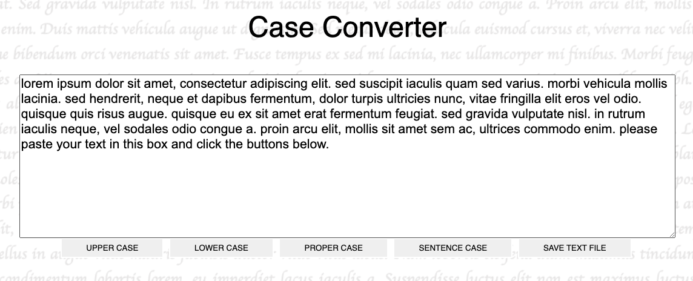
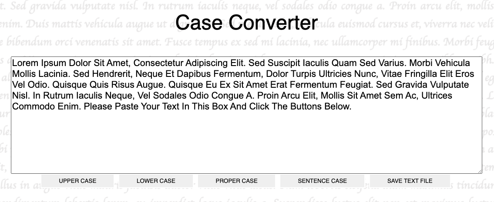
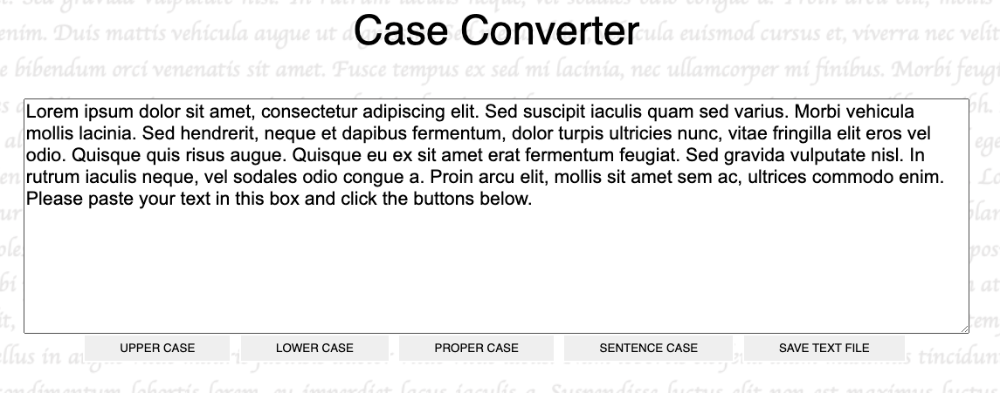
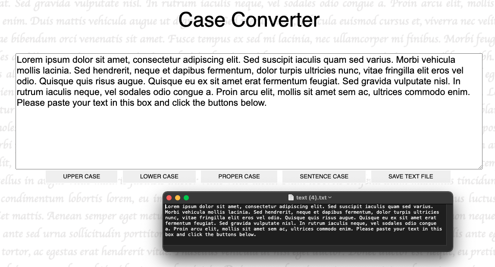

# Case Converter
## Description
### The project was to create a webpage that can convert text to lowercase, uppercase, "proper-case" and "sentence-case" and allow download of the result.
## Usage
### The webpage can be used in [CodePen](https://codepen.io/alkkla/pen/XWzEveQ). Alternatively download this repo and launch "index.html". "Proper-case" capitalises each word whereas "sentence-case" capitalises only the first word of the sentence. 
### Uppercase

### Lowercase

### Proper Case

### Sentence Case

### Save Text

